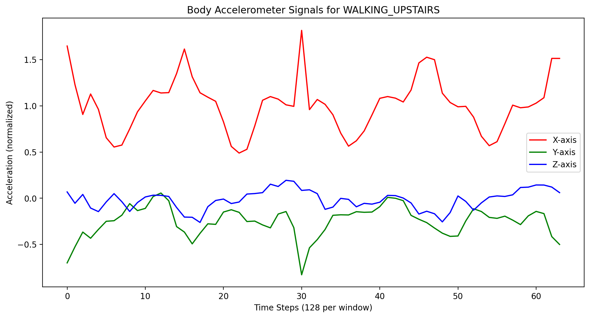
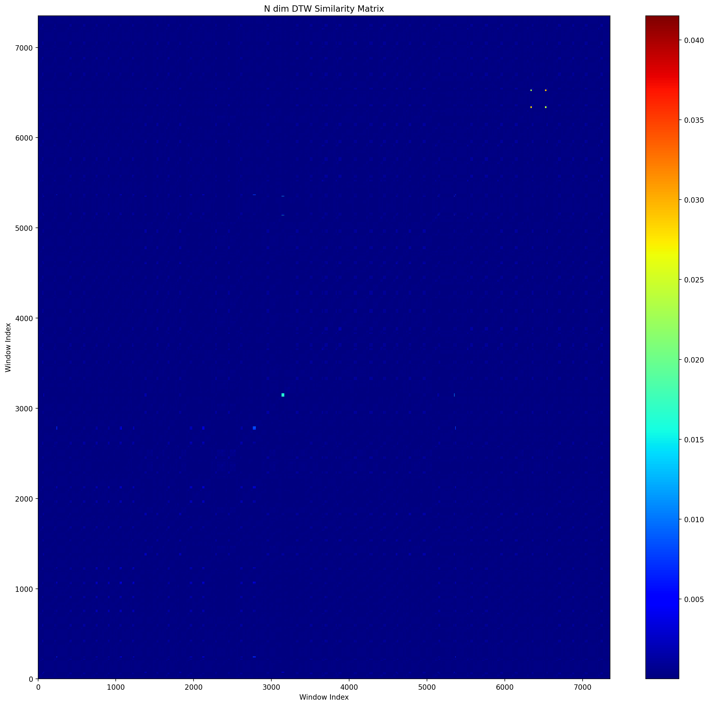
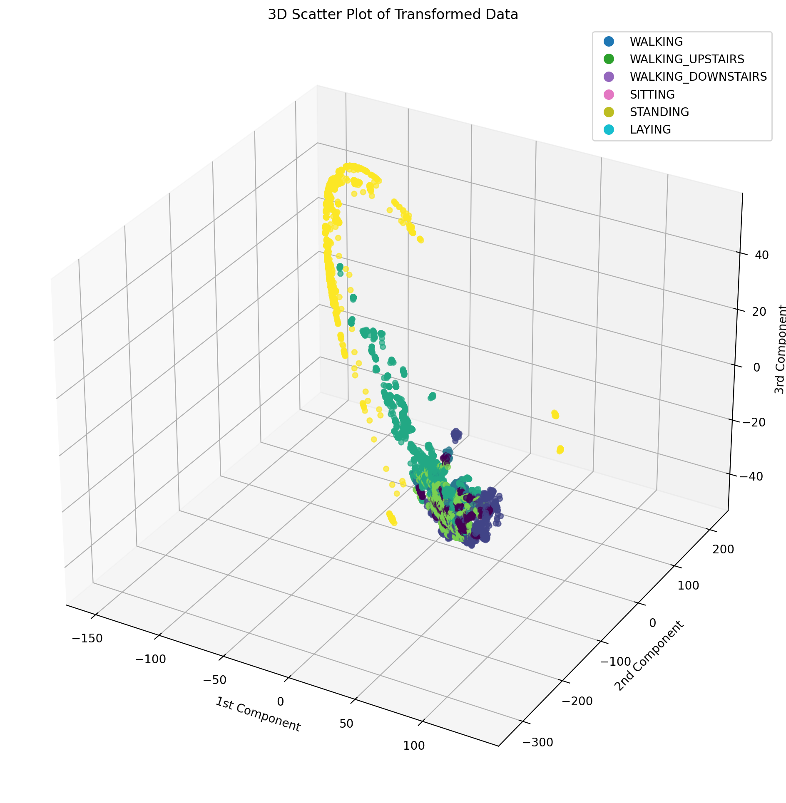
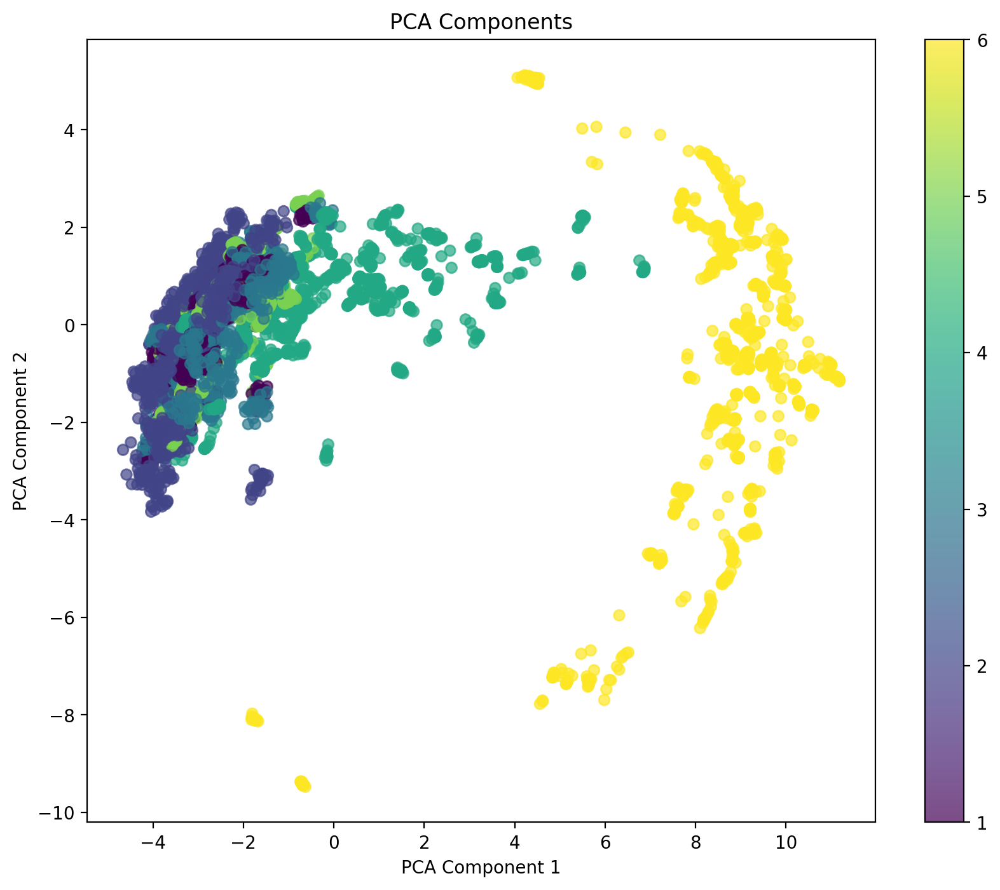
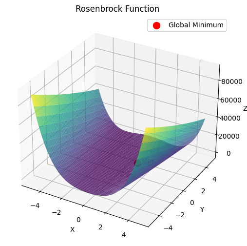
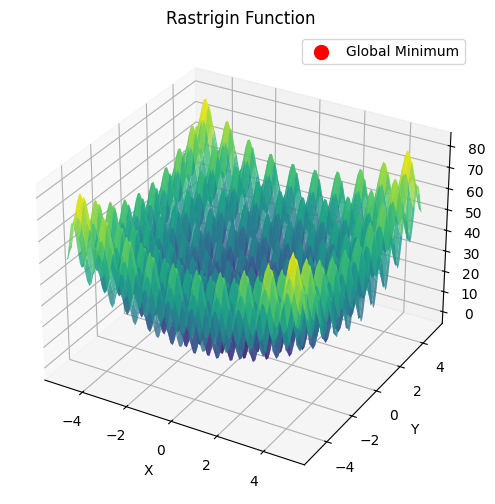
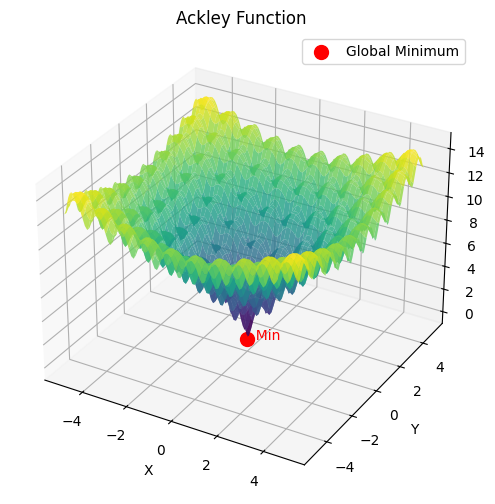
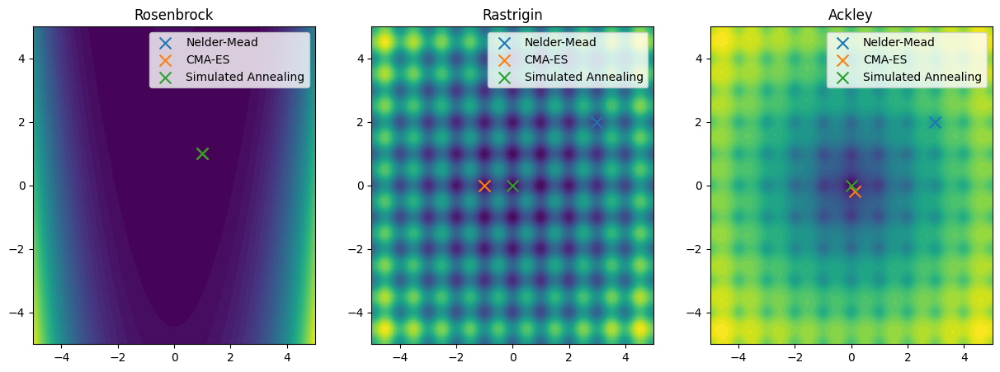

### CS303 - Mathematical Foundations for AI

# Coding Assignment

---

> Romit Mohane  
> 23110279

---

#### **Problem 1.** This assignment explores _Diffusion Maps_, a manifold learning technique, to _cluster time-series data_. You will work with the _UCI Human Activity Recognition (HAR) dataset_ and apply Diffusion Maps for dimensionality reduction before clustering. The goal is to analyze how well this approach separates human motion activities.

> Dataset Description
>
> -   Overlapping samples of window length 128, overlap 64, windowed from original readings at 50Hz
> -   7352 samples, distributed among 30 volunteers and 6 activities.
> -   Each sample consists of accelerometer and gyroscope time-series data.
> -   Accelerometer data consists of: total/body acceleration in 3 axes: X, Y, Z in units of standard gravity (g), where each reading is 128 numbers long

##### I am using the `body acceleration` data in X, Y and Z directions (3 dimensions) for training and testing

For DTW Matrix we can use 2 algorithms, according to the paper [ Generalizing DTW to the multi-dimensional case requires an
adaptive approach](https://pmc.ncbi.nlm.nih.gov/articles/PMC5668684/pdf/nihms885347.pdf).

1. Compute DTW matrices for 3 dimensions (X, Y, Z) seperately and add them for the final d.
1. Redefine $d(q_i, c_j)$ as the cumulative squared Euclidean distances of M data points instead of the single data point used in the more familiar one-dimensional case.

The 2nd algorithm is the better suited one in this problem, but we have implemented both.

Result DTW similarity matrix

##### Apply Diffusion Maps for Dimensionality Reduction

reference from https://en.wikipedia.org/wiki/Diffusion_map

epsilon can be the median of the similarity matrix, or the median squared. Im using median squared for better performance

result diffusion matrix

Compute the **normalized graph Laplacian** for Diffusion Maps and its leading eigenvectors.
$$L^{\alpha} = D^{-\frac{1}{2}} A D^{-\frac{1}{2}} $$
$$L = (D^\alpha)^{-1} \cdot L^{\alpha}$$

3. Use the top 2 or 3 diffusion coordinates to embed the time series into a **low-dimensional space.**  
   _Using top 3 (except 1st)_

Transformed Low Dimensional Data after projecting DTW matrix on the weighted eigenvectors

#### **Task 3**: Clustering in the Diffusion Space

ARI for KMeans 0.27491553358810045  
Silhouette score for KMeans 0.5336251764651125

ARI for Raw Signals (KMeans) 0.1855608046603372  
Silhouette score for Raw Signals (KMeans) 0.24131427642334816

_PCA_
  
ARI for PCA (KMeans) 0.21111252191923122  
Silhouette score for PCA (KMeans) 0.3598768330700726

ARI for t-SNE (KMeans) 0.18297716387410884  
Silhouette score for t-SNE (KMeans) 0.28417122

##### Conclusion

Diffusion Maps are designed to uncover the underlying low-dimensional manifold where the data points are embedded, rather than simply treating each data point as a vector in a high-dimensional space. This is particularly useful for time series, where the data often lies on a complex, non-linear manifold. Diffusion Maps are sensitive to non-linear relationships, which are common in time series data. This allows them to capture complex patterns and structures that might be missed by linear clustering algorithms.

#### **Problem 2. (Derivative-Free Optimization Methods).** This assignment explores **Nelder-Mead, Simulated Annealing**, and **Covariance Matrix Adaptation Evolution Strategy (CMA-ES)**. You will implement these optimization techniques and compare their performance on different objective functions. Implement or use available libraries to apply the following optimization techniques:

-   **Nelder-Mead** (Simplex Method)
-   **Simulated Annealing**
-   **CMA-ES (Covariance Matrix Adaptation Evolution Strategy)**

#### **Task 1**: Benchmarking on Test Functions (1 mark)

rosenbrock  

rastrigin

auckley

**Results**
Rosenbrock (Nelder-Mead) -> Best Solution: [0.99999541 0.99999385], Best Value: 9.428032652230973e-10  
Rosenbrock (CMA-ES) -> Best Solution: [0.99999998 0.99999995], Best Value: 1.2127767215086085e-15  
Rosenbrock (Simulated Annealing) -> Best Solution: [0.999997 0.999994], Best Value: 8.981059995262747e-12

Rastrigin (Nelder-Mead) -> Best Solution: [2.9848608 1.98990209], Best Value: 12.934432457529672  
Rastrigin (CMA-ES) -> Best Solution: [-9.94958636e-01 -2.37996613e-09], Best Value: 0.9949590570932934  
Rastrigin (Simulated Annealing) -> Best Solution: [-5.49024430e-09 -5.09304327e-09], Best Value: 1.0658141036401503e-14

Ackley (Nelder-Mead) -> Best Solution: [2.973137 1.98210329], Best Value: 7.961711310187326  
Ackley (CMA-ES) -> Best Solution: [ 0.11476224 -0.17650741], Best Value: 1.4859381105153244  
Ackley (Simulated Annealing) -> Best Solution: [-3.08676924e-09 -4.91178573e-09], Best Value: 1.6408236991338754e-08  

#### **Task 2:** Hyperparameter Tuning in Machine Learning (2 marks)

##### Run 1:
Results for rbf kernel:   
Nelder-Mead: Params=[1.4999999999999991, 0.00099999999999998], Accuracy=0.8500   
Dual Annealing: Params=[8.929634646108685, 0.020779420368303835], Accuracy=0.2500   
CMA-ES: Params=[1.9344732269285698, 0.00150230691260007], Accuracy=0.8600   

Results for poly kernel:  
Nelder-Mead: Params=[1.0, 0.01], Accuracy=0.8400  
Dual Annealing: Params=[0.3765878606800699, 0.24794463216660337], Accuracy=0.8400  
CMA-ES: Params=[1.3494968789900215, 0.3607557074675497], Accuracy=0.8400  

##### Run 2:
Results for rbf kernel:   
Nelder-Mead: Params=[1.4999999999999991, 0.00099999999999998], Accuracy=0.8500  
Dual Annealing: Params=[5.63333169875198, 0.0013765646652443952], Accuracy=0.8400  
CMA-ES: Params=[1.18098238967679, 0.0014177686991988846], Accuracy=0.8600  

Results for poly kernel:  
Nelder-Mead: Params=[1.0, 0.01], Accuracy=0.8400  
Dual Annealing: Params=[7.98588357502203, 0.8949187204028262], Accuracy=0.8400  
CMA-ES: Params=[1.6068565058997137, 0.004232806877080677], Accuracy=0.8500   
_where params = C, gamma_

_Observation: Simulated Annealing typically requires more function evaluations than the other two methods._   
_Observation: CMA-ES is usually the most stable, while Simulated Annealing provides diverse solutions but with potential variability._   
_Observation: CMA-ES often finds the best hyperparameters, while Simulated Annealing can sometimes find better solutions but is less predictable._  

